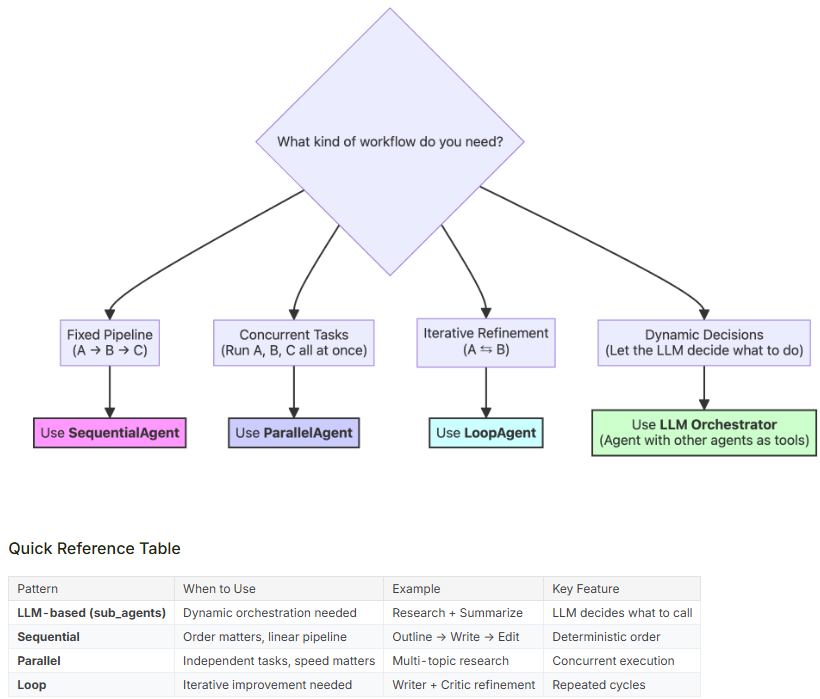

# Choosing the Right AI Agent Workflow Pattern

Selecting the right workflow pattern is crucial for building effective AI agent systems. The Google ADK provides four core patternsSequential, Parallel, Loop, and LLM-based orchestrationeach optimized for different task types and execution requirements. This guide helps you choose the best pattern for your use case.

## Decision Tree

Use this decision tree to quickly identify which workflow pattern best fits your needs. Ask yourself: **"What kind of workflow do I need?"**

- **Fixed Pipeline (A ’ B ’ C)?** Use `SequentialAgent` for deterministic, ordered execution
- **Concurrent Tasks (Run A, B, C all at once)?** Use `ParallelAgent` for independent, simultaneous operations
- **Iterative Refinement (A Ä B)?** Use `LoopAgent` for repeated cycles of improvement
- **Dynamic Decisions (Let the LLM decide)?** Use LLM Orchestrator with agents as tools

## Quick Reference Guide

| Pattern | When to Use | Example Use Case | Key Feature |
|---------|-------------|------------------|-------------|
| **LLM-based (sub_agents)** | Dynamic orchestration needed | Research + Summarize | LLM decides what to call |
| **Sequential** | Order matters, linear pipeline | Outline ’ Write ’ Edit | Deterministic order |
| **Parallel** | Independent tasks, speed matters | Multi-topic research | Concurrent execution |
| **Loop** | Iterative improvement needed | Writer + Critic refinement | Repeated cycles |

## Pattern Deep Dive

### Sequential Workflows  The Assembly Line

When tasks must run in a guaranteed, specific order, `SequentialAgent` ensures each step completes before the next begins. Output flows from one agent to the next in a predictable chain.

**Best for:**
- Linear pipelines where each step depends on previous outputs
- Deterministic workflows requiring strict ordering
- Simple error propagation and debugging

**See:** [sequential_agents/](sequential_agents/) for implementation examples

### Parallel Workflows  Divide and Conquer

When tasks are independent and can run simultaneously, `ParallelAgent` executes all sub-agents concurrently, dramatically reducing total execution time.

**Best for:**
- Independent research or data gathering from multiple sources
- Speed-critical operations where tasks don't depend on each other
- Aggregating results from different specialized agents

**See:** [parallel_agents/](parallel_agents/) for implementation examples

### Loop Workflows  Iterative Refinement

When output quality improves through repeated cycles, `LoopAgent` enables iterative refinement patterns where agents critique and improve work until quality thresholds are met.

**Best for:**
- Writer-critic patterns requiring multiple revision rounds
- Quality improvement through feedback loops
- Converging on optimal solutions through iteration

**See:** [loop_agents/](loop_agents/) for implementation examples

### LLM Orchestration  Intelligent Coordination

When the workflow itself requires dynamic decision-making, use an LLM-based orchestrator that treats other agents as callable tools, allowing the AI to choose which agents to invoke and when.

**Best for:**
- Complex research tasks requiring adaptive strategies
- Workflows where the next step depends on intermediate results
- Maximum flexibility at the cost of determinism

**See:** [specialist_agents/](specialist_agents/) for implementation examples

## Choosing Your Pattern: Key Questions

1. **Do steps need to run in a specific order?**
   - Yes ’ Consider `SequentialAgent`
   - No ’ Continue to question 2

2. **Can tasks run independently without dependencies?**
   - Yes ’ Use `ParallelAgent` for speed
   - No ’ Continue to question 3

3. **Does output improve through repeated refinement?**
   - Yes ’ Use `LoopAgent` for iteration
   - No ’ Continue to question 4

4. **Should the AI decide which agents to invoke?**
   - Yes ’ Use LLM Orchestrator pattern
   - No ’ Reconsider your requirements

## Notes and Trade-offs

- **Sequential** workflows are simple and predictable but can be slower when parallelization is possible
- **Parallel** workflows maximize speed but require truly independent tasks to be effective
- **Loop** workflows excel at quality improvement but may increase latency and token usage
- **LLM orchestration** provides maximum flexibility but sacrifices determinism and can be harder to debug

## Getting Started

Each workflow pattern has its own directory with detailed examples and implementation guidance:

- **[sequential_agents/](sequential_agents/)**  Blog post creation pipeline (Outline ’ Write ’ Edit)
- **[parallel_agents/](parallel_agents/)**  Multi-topic research aggregation
- **[loop_agents/](loop_agents/)**  Iterative content refinement
- **[specialist_agents/](specialist_agents/)**  Research team with dynamic coordination

## See Also

- [Google ADK Documentation](https://google.github.io/adk-docs/)  Complete ADK reference and API documentation
- [Workflow Agents Guide](https://google.github.io/adk-docs/agents/workflow-agents/)  Detailed workflow patterns documentation
- [Agent Design Patterns](https://google.github.io/adk-docs/agents/)  Best practices for agent architecture

---
