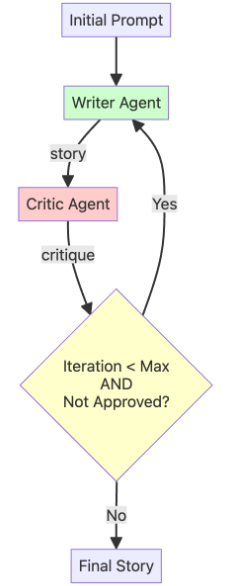

# Loop Workflows (The Refinement Cycle)

When tasks require iterative refinement until a quality threshold is met, use a `LoopAgent`. Think of it like an editorial process: agents repeatedly review and improve output until it meets approval criteria or reaches a maximum iteration limit. This creates an adaptive, quality-focused workflow for tasks that benefit from multiple rounds of feedback and revision.

## When to use

- **Iterative refinement** where output quality improves through multiple passes
- **Conditional exit** based on approval criteria or quality thresholds
- **Feedback loops** where one agent critiques and another revises

## Example Architecture  Story Refinement Pipeline

This pipeline demonstrates a common loop use case with three specialized agents:

- **Initial Writer Agent**  creates the first draft of a short story (runs once)
- **Critic Agent**  reviews the story and provides feedback or approval
- **Refiner Agent**  incorporates feedback to improve the story OR exits when approved

The Critic and Refiner agents run in a loop: the Critic evaluates the current story, the Refiner either improves it based on feedback or calls the `exit_loop` function when the Critic signals approval. This continues until the story is approved or the maximum iteration limit is reached.

## Notes and trade-offs

- Loop workflows are ideal for quality-driven tasks that benefit from iterative improvement, but can consume more tokens and time compared to single-pass workflows.
- Always set a `max_iterations` limit to prevent infinite loops and control costs.
- The exit condition should be clearly defined (for example, a specific approval phrase or quality metric) to ensure the loop terminates appropriately.
- If your task doesn't require iterative refinement, consider using a `SequentialAgent` for simpler linear pipelines.

## See also

- [ADK documentation](https://google.github.io/adk-docs/agents/workflow-agents/loop-agents/) for `LoopAgent`  consult your ADK docs for implementation details and examples.

---
