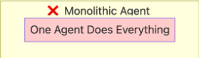
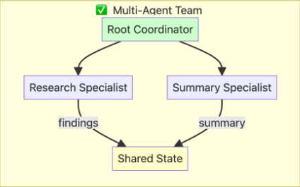

# Specialist Agents (The Expert Team)

When you need specialized expertise for different parts of a task, use **Specialist Agents**. Think of it like assembling a team of experts: a root coordinator agent orchestrates the workflow by calling specialized sub-agents as tools. Each specialist has a focused role and specific capabilities, and the coordinator decides when and how to use them based on the task at hand.

## Why Use Specialist Agents?

A monolithic agent trying to handle all tasks can become overwhelmed and less effective. Specialist agents solve this by distributing expertise across focused agents.

## When to use

- **Specialized expertise** where different agents handle distinct capabilities
- **Dynamic orchestration** where the coordinator decides which specialists to call
- **Tool-based composition** where sub-agents are wrapped as tools for the root agent

## Example Architecture  Research & Summarization Pipeline

This pipeline demonstrates a common specialist use case with a coordinator and two specialists:

- **Research Agent**  specialized in using Google Search to find relevant information
- **Summarizer Agent**  specialized in creating concise, bulleted summaries
- **Root Coordinator**  orchestrates the workflow by calling specialists as tools

The coordinator receives the user's query, calls the Research Agent to gather information, then calls the Summarizer Agent to create a final summary. Unlike sequential workflows, the coordinator has flexibility in how it uses its specialist tools.

## Notes and trade-offs

- Specialist workflows provide flexibility and dynamic decision-making, but require a capable coordinator to orchestrate effectively.
- The coordinator can choose which specialists to call and in what order, making this pattern more adaptable than fixed sequential pipelines.
- Best for tasks requiring distinct areas of expertise that may be combined in different ways depending on the input.

## See also

- [ADK documentation](https://google.github.io/adk-docs/agents/) for Agent composition patterns  consult your ADK docs for implementation details and examples on using `AgentTool` to wrap agents as callable tools.

---
